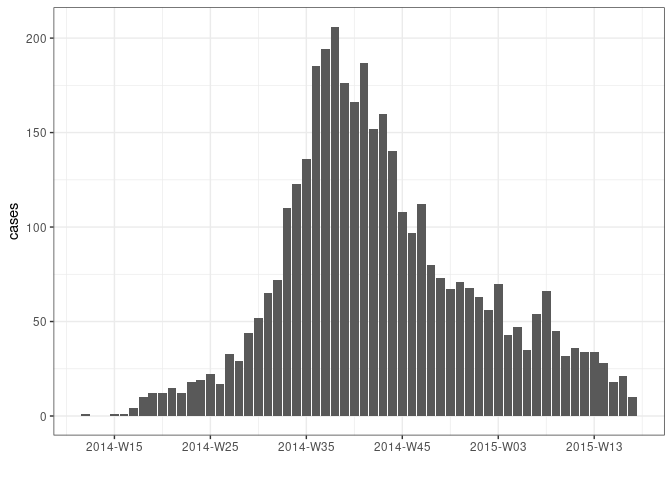

<!-- README.md is generated from README.Rmd. Please edit that file -->

# grates

<!-- badges: start -->

[](https://codecov.io/gh/reconverse/grates?branch=main)
[](https://github.com/reconverse/grates/actions)
[](https://www.reconverse.org/lifecycle.html#maturing)
<!-- badges: end -->

**grates** provides a simple and coherent implementation of grouped date
classes, including:

  - year-week (`as_yrwk()`) with arbitrary first day of the week;
  - year-month (`as_yrmon()`);
  - year-quarter (`as_yrqtr()`);
  - year (`as_yr()`);
  - periods (`as_period()`) of arbitrary length.

These classes aim to be formalise the idea of a grouped date whilst also
being intuitive in their use. They build upon ideas of Davis Vaughan and
the unreleased [datea](https://github.com/DavisVaughan/datea/) package.

For each of the grouped date classes, **grates** also provides
**scales** to use with
[ggplot2](https://cran.r-project.org/package=ggplot2). At the same time
**grates** has no strong dependencies so is also well suited to more
minimal analytical pipelines.

## Installation

You can install the development version from
[GitHub](https://github.com/) with:

``` r
# install.packages("remotes")
remotes::install_github("reconhub/grates")
```

## Vignette

A short illustration of **grates** functionality is provided in the
worked example below. A more detailed introduction is available in the
vignette included with the package:

  - `vignette("introduction", package = "grates")`

## Example

``` r
library(outbreaks)  # for data
library(dplyr)      # for data manipulation
library(ggplot2)    # for plotting
library(grates) 

# load some simulated linelist data
dat <- ebola_sim_clean$linelist

# group by week
weekly_dat <- 
  dat %>%
  mutate(date = as_yrwk(date_of_infection, firstday = 2)) %>% 
  count(date, name = "cases") %>% 
  na.omit()

head(weekly_dat, 8)
#>       date cases
#> 1 2014-W12     1
#> 2 2014-W15     1
#> 3 2014-W16     1
#> 4 2014-W17     4
#> 5 2014-W18    10
#> 6 2014-W19    12
#> 7 2014-W20    12
#> 8 2014-W21    15

# plot
ggplot(weekly_dat, aes(date, cases)) + geom_col() + theme_bw() + xlab("")
```



We make working with `yrwk` and other grouped date objects easier by
adopting logical conventions:

``` r
dates <- as.Date("2021-01-01") + 0:30
weeks <- as_yrwk(dates, firstday = 5) # firstday = 5 to match first day of year
head(weeks, 8)
#> [1] "2021-W01" "2021-W01" "2021-W01" "2021-W01" "2021-W01" "2021-W01" "2021-W01"
#> [8] "2021-W02"
str(weeks)
#>  'yrwk' num [1:31] 2021-W01 2021-W01 2021-W01 2021-W01 ...
#>  - attr(*, "firstday")= int 5
dat <- tibble(dates, weeks)

# addition of wholenumbers will add the corresponding number of weeks to the object
dat %>% 
  mutate(plus4 = weeks + 4)
#> # A tibble: 31 x 3
#>    dates      weeks    plus4   
#>    <date>     <yrwk>   <yrwk>  
#>  1 2021-01-01 2021-W01 2021-W05
#>  2 2021-01-02 2021-W01 2021-W05
#>  3 2021-01-03 2021-W01 2021-W05
#>  4 2021-01-04 2021-W01 2021-W05
#>  5 2021-01-05 2021-W01 2021-W05
#>  6 2021-01-06 2021-W01 2021-W05
#>  7 2021-01-07 2021-W01 2021-W05
#>  8 2021-01-08 2021-W02 2021-W06
#>  9 2021-01-09 2021-W02 2021-W06
#> 10 2021-01-10 2021-W02 2021-W06
#> # … with 21 more rows

# addition of two yrwk objects will error as it is unclear what the intention is
dat %>% 
  mutate(plus4 = weeks + weeks)
#> Error: Problem with `mutate()` input `plus4`.
#> x Cannot add <yrwk> objects to each other
#> ℹ Input `plus4` is `weeks + weeks`.

# Subtraction of wholenumbers works similarly to addition
dat %>% 
  mutate(minus4 = weeks - 4)
#> # A tibble: 31 x 3
#>    dates      weeks    minus4  
#>    <date>     <yrwk>   <yrwk>  
#>  1 2021-01-01 2021-W01 2020-W49
#>  2 2021-01-02 2021-W01 2020-W49
#>  3 2021-01-03 2021-W01 2020-W49
#>  4 2021-01-04 2021-W01 2020-W49
#>  5 2021-01-05 2021-W01 2020-W49
#>  6 2021-01-06 2021-W01 2020-W49
#>  7 2021-01-07 2021-W01 2020-W49
#>  8 2021-01-08 2021-W02 2020-W50
#>  9 2021-01-09 2021-W02 2020-W50
#> 10 2021-01-10 2021-W02 2020-W50
#> # … with 21 more rows

# Subtraction of two yrwk objects gives the difference in weeks between them
dat %>% 
  mutate(plus4 = weeks + 4, difference = plus4 - weeks)
#> # A tibble: 31 x 4
#>    dates      weeks    plus4    difference
#>    <date>     <yrwk>   <yrwk>        <int>
#>  1 2021-01-01 2021-W01 2021-W05          4
#>  2 2021-01-02 2021-W01 2021-W05          4
#>  3 2021-01-03 2021-W01 2021-W05          4
#>  4 2021-01-04 2021-W01 2021-W05          4
#>  5 2021-01-05 2021-W01 2021-W05          4
#>  6 2021-01-06 2021-W01 2021-W05          4
#>  7 2021-01-07 2021-W01 2021-W05          4
#>  8 2021-01-08 2021-W02 2021-W06          4
#>  9 2021-01-09 2021-W02 2021-W06          4
#> 10 2021-01-10 2021-W02 2021-W06          4
#> # … with 21 more rows

# weeks can be combined if they have the same firstday but not otherwise
wk1 <- as_yrwk("2020-01-01")
wk2 <- as_yrwk("2021-01-01")
c(wk1, wk2)
#> [1] "2020-W01" "2020-W53"
wk3 <- as_yrwk("2020-01-01", firstday = 2)
c(wk1, wk3)
#> Error: Unable to combine <yrwk> objects with different `firstday` attributes
```
