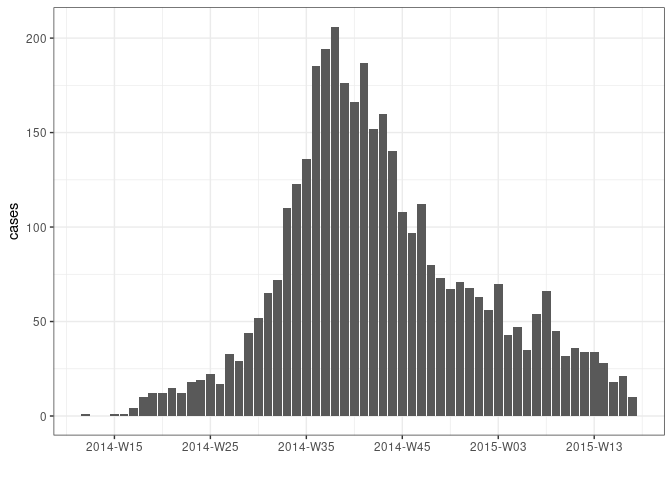
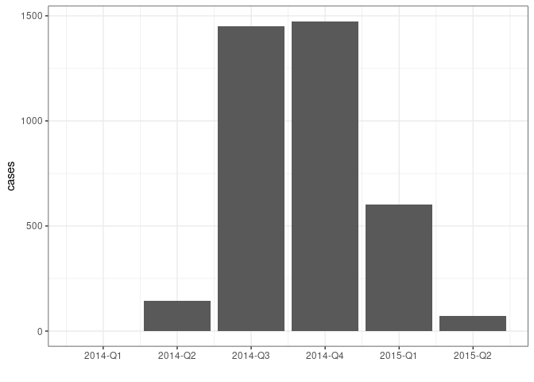
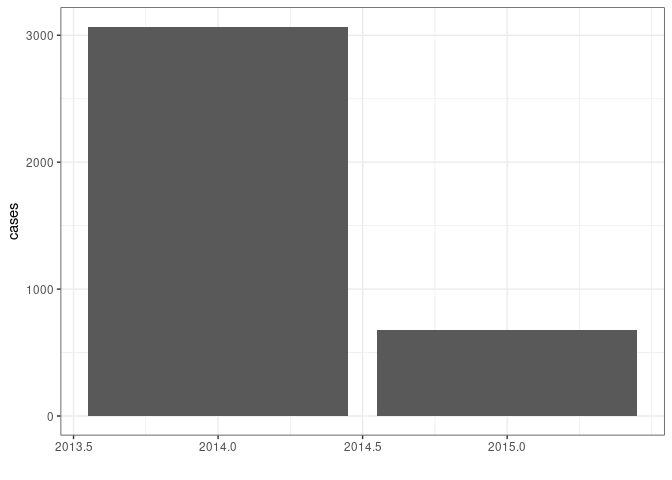

<!-- README.md is generated from README.Rmd. Please edit that file -->

# grates

<!-- badges: start -->

<!-- badges: end -->

*grates* provides a simple and coherent implementation of grouped date
classes, including:

  - year-week (**`as_yrwk()`**) with arbitrary first day of the week;
  - year-month (**`as_yrmon()`**);
  - year-quarter (**`as_yrqtr()`**);
  - year (**`as_yr()`**);
  - periods (**`as_period()`**) of arbitrary length.

## Installation

You can install the development version from
[GitHub](https://github.com/) with:

``` r
# install.packages("remotes")
remotes::install_github("reconhub/grates")
```

## Examples

``` r
library(outbreaks)
library(dplyr)
library(tidyr)
library(ggplot2)
library(grates) 

dat <- ebola_sim_clean$linelist
```

### yrwk

``` r
dat %>%
  mutate(date = as_yrwk(date_of_infection, firstday = 2)) %>% 
  count(date, name = "cases") %>% 
  drop_na() %>% 
  ggplot(aes(date, cases)) + geom_col() + theme_bw() + xlab("")
```



### yrmon

``` r
dat %>%
  mutate(date = as_yrmon(date_of_infection)) %>% 
  count(date, name = "cases") %>% 
  drop_na() %>% 
  ggplot(aes(date, cases)) + geom_col() + theme_bw() + xlab("") 
```


### yrqtr

``` r
dat %>%
  mutate(date = as_yrqtr(date_of_infection)) %>% 
  count(date, name = "cases") %>% 
  drop_na() %>% 
  ggplot(aes(date, cases)) + geom_col() + theme_bw() + xlab("") 
```



### yr

``` r
dat %>%
  mutate(date = as_yr(date_of_infection)) %>% 
  count(date, name = "cases") %>% 
  drop_na() %>% 
  ggplot(aes(date, cases)) + geom_col() + theme_bw() + xlab("") 
```


